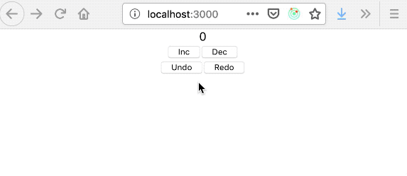
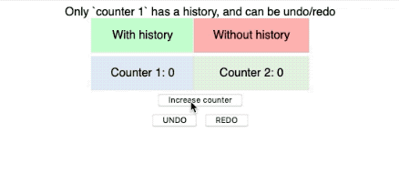

# Storeon undo


Tiny module for [Storeon] which is adding undo functionality to your state. This means that now you can undoing or redoing the events in the state.

It is just 348 bytes module (it uses [Size Limit] to control the size) without any dependencies.

[Size Limit]: https://github.com/ai/size-limit
[Storeon]: https://github.com/storeon/storeon

```js
import { undoable, UNDO, REDO } from '@storeon/undo/full'

const store = createStore([
  /* all your modules */
  undoable
 ])

// now you can use UNDO and REDO with dispatch
dispatch(UNDO)
```



## Installation

```
npm install @storeon/undo
# or
yarn add @storeon/undo
```

If you need to support IE, you need to [compile `node_modules`] with Babel.

[compile `node_modules`]: https://developer.epages.com/blog/coding/how-to-transpile-node-modules-with-babel-and-webpack-in-a-monorepo/

## Usage

You can use this module in two ways:

- store history for all state
- store history only for specific keys


### Store history for all state

To using the undo/redo functionality you just need to add the `undoable` module to `createStore`.

```js
import createStore from 'storeon'
import { undoable, UNDO, REDO } from '@storeon/undo/full'

let counter = store => {
  store.on('@init', () => ({ counter: 0 }))

  store.on('inc', (state) => ({ counter: state.counter + 1}))
  store.on('dec', (state) => ({ counter: state.counter - 1}))
}

const store = createStore([
  counter,
  undoable
 ])
```

And now you can use the functions `undo` and `redo` to manipulate the history.

```js
const Counter = () => {
  const { dispatch, counter } = useStoreon('counter')
  return <React.Fragment>
    <div>{counter}</div>
    <button onClick={() => dispatch('inc')}>Inc</button>
    <button onClick={() => dispatch('dec')}>Dec</button>
  </React.Fragment>
}

const UndoRedo = () => {
  const { dispatch } = useStoreon()

  return <>
    <button onClick={() => dispatch(UNDO)}>Undo</button>
    <button onClick={() => dispatch(REDO)}>Redo</button>
  </>
}
```

### Store history only for specific keys

If you need history only for some particular keys in state you can use `createHistory` function:

```js
import {createHistory} from '@storeon/undo'

// history will be collect only for key `a`
const history = createHistory(['a'])
const { UNDO, REDO } = history

createStore([
  /* all your modules */
  history.module
])

// to change the history use the UNDO and REDO from `history` object
dispatch(UNDO)
```



## LICENSE

MIT

## Acknowledgments

This module based on [Implementing Undo History recipe](https://redux.js.org/recipes/implementing-undo-history) article.

